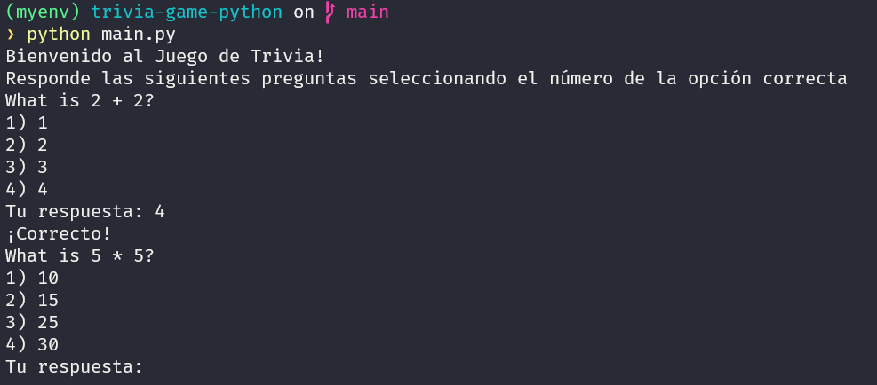
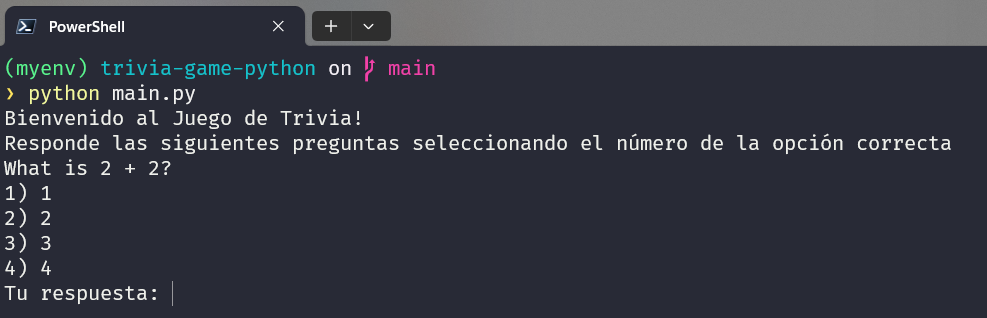
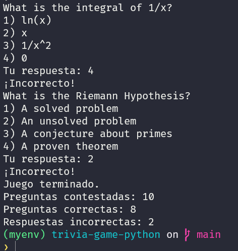

## Curso: Desarrollo de Software
### Juego de trivia

#### Proyecto completo: Juego de Trivia con FastAPI, PostgreSQL y DevOps

##### Descripción del juego de trivia:

El juego de Trivia es un juego de preguntas y respuestas donde los jugadores deben responder preguntas de opción múltiple presentadas en la consola. Cada pregunta contiene exactamente una respuesta correcta entre varias opciones. El juego es simple, pero debe ser implementado de manera que demuestre el manejo efectivo de la lógica básica de programación, estructuras de datos, y pruebas unitarias.

Reglas y funcionamiento del juego:

* Inicio del juego: Al lanzar el juego, se muestra un mensaje de bienvenida junto con las instrucciones sobre cómo jugar.

* Número de rondas: El juego constará de un total de 10 rondas, cada una con una pregunta única.

* Preguntas: Se presenta una pregunta con cuatro opciones de respuesta numeradas. Solo una opción es correcta.

* Selección de respuesta: El jugador elige su respuesta ingresando el número correspondiente a la opción elegida.

* Puntuación: Cada respuesta correcta otorga un punto. No se penaliza por respuestas incorrectas.

* Fin del Juego: Al finalizar las rondas, se muestra la puntuación total del jugador, junto con un desglose de respuestas correctas e incorrectas.

Formato de salida en consola:



##### Instrucciones por sprints:
##### Sprint 1: Estructura básica y preguntas

Objetivo:
Configurar el entorno del proyecto y desarrollar la lógica básica para la manipulación y presentación de preguntas y respuestas

Tareas:

1. Configuración del proyecto con FastAPI y Docker:

* Crea la estructura básica del proyecto en Python con FastAPI y Docker
```shell
    $ mkdir trivia-game-python
    $ cd trivia-game-python
    $ python3 -m venv venv
    $ source venv/bin/activate
    $ pip install fastapi uvicorn
    $ pip install asyncpg databases
```
* Crea un archivo Dockerfile para el entorno de FastAPI y PostgreSQL

```shell
    FROM python:3.9-slim
    WORKDIR /app
    COPY requirements.txt .
    RUN pip install --no-cache-dir -r requirements.txt
    COPY . .
    EXPOSE 8000
    CMD ["uvicorn","main:app","--host","0.0.0.0","--port","8000"]
```
*  Crea un archivo docker-compose.yml para gestionar PostgreSQL.

```shell
    version: '3.8'
    services:
    db:
        image: postgres:13
        environment:
        POSTGRES_USER: user
        POSTGRES_PASSWORD: password
        POSTGRES_DB: trivia_db
        ports:
        - "5433:5432"
        volumes:
        - postgres_data:/var/lib/postgresql/data
        networks:
        - trivia_net
    web:
        build: .
        command: uvicorn main:app --host 0.0.0.0 --port 8000 --reload
        ports:
        - "8000:8000"
        volumes:
        - .:/app
        environment:
        DATABASE_URL: postgres://user:password@db:5432/trivia_db
        depends_on:
        - db
        networks:
        - trivia_net

    volumes:
    postgres_data:

    networks:
    trivia_net:
```

2. Desarrollo de la clase Question:
* Implementa la clase Question en Python para gestionar las preguntas y respuestas.

```shell
    class Question:
        def __init__(self, description, options, correct_answer, difficulty):
            self.description = description
            self.options = options
            self.correct_answer = correct_answer
            self.difficulty = difficulty

        def is_correct(self, answer):
            return self.correct_answer == answer
```

3. Implementación de la clase Quiz:

* Implementa la clase Quiz para manejar el flujo del juego, incluyendo la presentación de preguntas y la recepción de respuestas.


```shell
    class Quiz:
        def __init__(self):
            self.questions = []
            self.current_question_index = 0
        def add_question(self, question):
            self.questions.append(question)
        def get_next_question(self):
            if self.current_question_index < len(self.questions):
                question = self.questions[self.current_question_index]
                self.current_question_index += 1
                return question
        return None
```

4. Pruebas unitarias:

*  Configura pytest e implementa pruebas unitarias para la clase Question.

```shell
    $ pip install pytest
```

* Crea un archivo test_question.py con pruebas iniciales.

```shell
import pytest
from trivia import Question
def test_question_correct_answer():
    question = Question("What is 2 + 2?", ["1", "2", "3", "4"], "4")
    assert question.is_correct("4")
    def test_question_incorrect_answer():
    question = Question("What is 2 + 2?", ["1", "2", "3", "4"], "4")
    assert not question.is_correct("2")
```

5. Gestión de Git y branching:
* Configura Git y sigue las estrategias de branching.

```shell
    $ git init
    $ git branch develop
    $ git checkout develop
    $ git branch feature/structure-basic
```

##### Sprint 2: Lógica del juego y puntuación 

Objetivo:
Implementar un sistema de puntuación y refinar la lógica del juego para manejar múltiples rondas y la terminación del juego.

Tareas:

1. Ampliar la clase Quiz:
*  Amplía la clase Quiz para incluir un sistema de puntuación que rastree las respuestas correctas e incorrectas.

```shell
    class Quiz:
        def __init__(self):
            self.questions = []
            self.current_question_index = 0
            self.correct_answers = 0
            self.incorrect_answers = 0
        def add_question(self, question):
            self.questions.append(question)
        def get_next_question(self):
            if self.current_question_index < len(self.questions):
                question = self.questions[self.current_question_index]
                self.current_question_index += 1
                return question
            return None
        def answer_question(self, question, answer):
            if question.is_correct(answer):
                self.correct_answers += 1
                return True
            else:
                self.incorrect_answers += 1
                return False
```

2. Pruebas unitarias para puntuación:
* Implementa pruebas para verificar el sistema de puntuación.

```shell
    from trivia import Quiz, Question
    def test_quiz_scoring():
        quiz = Quiz()
        question = Question("What is 2 + 2?", ["1", "2", "3", "4"], "4")
        quiz.add_question(question)
        assert quiz.answer_question(question, "4") == True
        assert quiz.correct_answers == 1
```
3. Manejo de rondas y terminación del juego:
* Implementa la lógica para manejar las 10 rondas del juego y finalizarlo.

```shell
    def run_quiz():
        quiz = Quiz()
        while quiz.current_question_index < 10:
            question = quiz.get_next_question()
            if question:
                print(question.description)
                for idx, option in enumerate(question.options):
                    print(f"{idx + 1}) {option}")
                answer = input("Tu respuesta: ")
                if quiz.answer_question(question, answer):
                    print("¡Correcto!")
                else:
                    print("Incorrecto.")
            else:
                break
        print(f"Juego terminado. Respuestas correctas: {quiz.correct_answers}, incorrectas:
        {quiz.incorrect_answers}")
```

4. Gestión de Git:
* Fusiona las ramas feature en develop.

```shell
    $ git checkout develop
    $ git merge feature/structure-basic
```

##### Sprint 3: Mejoras en la interfaz y refinamiento

Objetivo:
Mejorar la interfaz de usuario en la consola y agregar característica adicionales como niveles de dificultad.

```shell
    def run_quiz():
        print("Bienvenido al Juego de Trivia!")
        print("Responde las siguientes preguntas seleccionando el número de la opción correcta")
        quiz = Quiz()

        conn = connect_db()
        create_tables(conn)
        questions = fetch_questions(conn)

        if not questions:
            initial_questions = [
                Question("What is 2 + 2?", ["1", "2", "3", "4"], "4", "fácil"),
                Question("What is 5 * 5?", ["10", "15", "25", "30"], "25", "fácil"),
                Question("Capital of Spain?", ["Madrid", "Barcelona", "Valencia", "Sevilla"], "Madrid", "fácil"),
                Question("Which animal is known as the king of the jungle?", ["Lion", "Tiger", "Elephant", "Bear"], "Lion", "fácil"),

                Question("Capital of France?", ["Berlin", "London", "Paris", "Rome"], "Paris", "media"),
                Question("Square root of 144?", ["10", "11", "12", "13"], "12", "media"),
                Question("Which planet is known as the Red Planet?", ["Earth", "Mars", "Jupiter", "Saturn"], "Mars", "media"),

                Question("What is the derivative of x^2?", ["2x", "x^2", "x", "0"], "2x", "difícil"),
                Question("What is the integral of 1/x?", ["ln(x)", "x", "1/x^2", "0"], "ln(x) + C", "difícil"),

                Question("What is the Riemann Hypothesis?", 
                        ["A solved problem", "An unsolved problem", "A conjecture about primes", "A proven theorem"], 
                        "A conjecture about primes", "muy difícil")
            ]
            for question in initial_questions:
                insert_question(conn, question)

            questions = fetch_questions(conn)

        for question in questions:
            quiz.add_question(question)

        while True:
            question = quiz.get_next_question()
            if question:
                print(question.description)
                for idx, option in enumerate(question.options):
                    print(f"{idx + 1}) {option}")
                answer = input("Tu respuesta: ")
                try:
                    selected_index = int(answer) - 1
                    if 0 <= selected_index < len(question.options):
                        selected_answer = question.options[selected_index]
                        if quiz.answer_question(question, selected_answer):
                            print("¡Correcto!")
                        else:
                            print("¡Incorrecto!")
                except ValueError:
                    print("Opción no válida.")
            else:
                break

        print("Juego terminado.")
        print(f"Preguntas contestadas: {quiz.total_answered_questions}")
        print(f"Preguntas correctas: {quiz.correct_answer}")
        print(f"Respuestas incorrectas: {quiz.incorrect_answer}")

        conn.close()
```

2. Niveles de dificultad:
*  Introduce niveles de dificultad y ajusta las preguntas basándose en el desempeño del jugador.

```shell
    class Quiz:
        def __init__(self):
            self.questions = []
            self.current_difficulty = "fácil"
            self.total_answered_questions = 0
            self.max_questions = 10
            self.correct_answer = 0
            self.incorrect_answer = 0
            
            self.answered_questions = {
                "fácil": 0,
                "media": 0,
                "difícil": 0,
                "muy difícil": 0
            }


        def add_question(self, question):
            self.questions.append(question)

        def get_next_question(self):
            if self.total_answered_questions >= self.max_questions:
                return None

            filtered_questions = [q for q in self.questions if q.difficulty == self.current_difficulty]

            if self.answered_questions[self.current_difficulty] >= len(filtered_questions):
                if self.current_difficulty == "fácil":
                    self.current_difficulty = "media"
                elif self.current_difficulty == "media":
                    self.current_difficulty = "difícil"
                elif self.current_difficulty == "difícil":
                    self.current_difficulty = "muy difícil"
                else:
                    return None
                
                return self.get_next_question()

            question = filtered_questions[self.answered_questions[self.current_difficulty]]
            self.answered_questions[self.current_difficulty] += 1
            self.total_answered_questions += 1

            return question


        def answer_question(self, question, answer):
            if question.is_correct(answer):
                self.correct_answer += 1
                return True
            else:
                self.incorrect_answer += 1
                return False
```

3. Pruebas unitarias adicionales:
* Implementa pruebas unitarias adicionales para validar las mejoras.

```shell
    #test_quiz.py
    @pytest.fixture
    def sample_questions():
        return [
            Question("What is 2 + 2?", ["2", "3", "4", "5"], "4", "fácil"),
            Question("Capital of France?", ["Berlin", "London", "Paris", "Rome"], "Paris", "media"),
            Question("What is the derivative of x^2?", ["2x", "x^2", "x", "0"], "2x", "difícil"),
            Question("What is the Riemann Hypothesis?", 
                        ["A solved problem", "An unsolved problem", "A conjecture about primes", "A proven theorem"], 
                        "A conjecture about primes", "muy difícil")
        ]

    def test_initializacion():
        quiz = Quiz()
        assert quiz.current_difficulty == "fácil"
        assert quiz.total_answered_questions == 0
        assert quiz.max_questions == 10
        assert quiz.correct_answer == 0
        assert quiz.incorrect_answer == 0
        assert quiz.answered_questions == {
            "fácil": 0,
            "media": 0,
            "difícil": 0,
            "muy difícil": 0
        }

    def test_add_question(sample_questions):
        quiz = Quiz()
        quiz.add_question(sample_questions[0])
        assert len(quiz.questions) == 1
        assert quiz.questions[0].description == "What is 2 + 2?"

    def test_get_next_question(sample_questions):
        quiz = Quiz()
        for question in sample_questions:
            quiz.add_question(question)

        question = quiz.get_next_question()
        assert question.description == "What is 2 + 2?"
        assert quiz.total_answered_questions == 1

        question = quiz.get_next_question()
        assert question.description == "Capital of France?"
        assert quiz.total_answered_questions == 2

    def test_answer_question_correctly(sample_questions):
        quiz = Quiz()
        for question in sample_questions:
            quiz.add_question(question)

        question = quiz.get_next_question()
        assert quiz.answer_question(question, "4")
        assert quiz.correct_answer == 1
        assert quiz.incorrect_answer == 0

    def test_answer_question_incorrectly(sample_questions):
        quiz = Quiz()
        for question in sample_questions:
            quiz.add_question(question)

        question = quiz.get_next_question()
        assert not quiz.answer_question(question, "2")
        assert quiz.correct_answer == 0
        assert quiz.incorrect_answer == 1

    def test_difficulty_transition(sample_questions):
        quiz = Quiz()
        for question in sample_questions:
            quiz.add_question(question)

        quiz.get_next_question()
        quiz.answer_question(quiz.questions[0], "4")
        quiz.get_next_question()
        quiz.answer_question(quiz.questions[1], "Paris")

        quiz.get_next_question()
        assert quiz.current_difficulty == "difícil"
```

```shell
    @pytest.fixture
    def setup_quiz():
        quiz = Quiz()

        quiz.add_question(Question("What is 2 + 2?",["1","2","3","4"],"4","fácil"))
        quiz.add_question(Question("What is 5 * 5?",["10","15","25","30"],"25","fácil"))
        quiz.add_question(Question("Capital of France?",["Berlin","London","Paris","Rome"],"Paris","media"))
        quiz.add_question(Question("Square root of 144?",["10","11","12","13"],"12","media"))
        return quiz

    def test_correct_answer_increases_score(setup_quiz):
        quiz = setup_quiz
        question = quiz.questions[0]
        quiz.answer_question(question, "4")
        assert quiz.correct_answer == 1
        assert quiz.incorrect_answer == 0

    def test_score_after_multiple_questions(setup_quiz):
        quiz = setup_quiz
        for question in quiz.questions:
            if question.description == "What is 2 + 2?":
                quiz.answer_question(question, "4")
            elif question.description == "What is 5 * 5?":
                quiz.answer_question(question, "25")
            elif question.description == "Capital of France?":
                quiz.answer_question(question, "Paris")
            else:
                quiz.answer_question(question, "11") # Esto es para la ultima pregunta que insertamos en quiz.add_question
        
        assert quiz.correct_answer == 3
        assert quiz.incorrect_answer == 1
```

```shell
    #test_quiz_scoring.py:
    @pytest.fixture
    def setup_quiz():
        quiz = Quiz()

        quiz.add_question(Question("What is 2 + 2?",["1","2","3","4"],"4","fácil"))
        quiz.add_question(Question("What is 5 * 5?",["10","15","25","30"],"25","fácil"))
        quiz.add_question(Question("Capital of France?",["Berlin","London","Paris","Rome"],"Paris","media"))
        quiz.add_question(Question("Square root of 144?",["10","11","12","13"],"12","media"))
        return quiz

    def test_correct_answer_increases_score(setup_quiz):
        quiz = setup_quiz
        question = quiz.questions[0]
        quiz.answer_question(question, "4")
        assert quiz.correct_answer == 1
        assert quiz.incorrect_answer == 0

    def test_score_after_multiple_questions(setup_quiz):
        quiz = setup_quiz
        for question in quiz.questions:
            if question.description == "What is 2 + 2?":
                quiz.answer_question(question, "4")
            elif question.description == "What is 5 * 5?":
                quiz.answer_question(question, "25")
            else:
                quiz.answer_question(question, "Berlin")
        
        assert quiz.correct_answer == 3
        assert quiz.incorrect_answer == 1
```

```shell
    #test_question.py
    @pytest.fixture
    def question():
        return Question(
            description = "Capital of France?",
            options = ["Berlin", "London", "Paris", "Rome"],
            correct_answer = "Paris",
            difficulty = "media"
        )

    def test_initialization(question):
        assert question.description == "Capital of France?"
        assert question.options == ["Berlin", "London", "Paris", "Rome"]
        assert question.correct_answer == "Paris"
        assert question.difficulty == "media"

    def test_is_correct(question):
        assert question.is_correct("Paris") is True
        assert question.is_correct("Berlin") is False
```

4. Pipeline CI/CD con GitHub Actions:

* Configura GitHub Actions para ejecutar las pruebas y verificar el despliegue con Docker.

```shell
    name: Python CI

    on:
        push:
            branches:
                - main
        
        pull_request:
            branches:
                - main

    jobs:
        build:
            runs-on: ubuntu-latest
            steps:
                - uses: actions/checkout@v2

                - name: Set up Python
                uses: actions/setup-python@v2
                with:
                    python-version: '3.9'

                - name: Instalación dependencias
                run: pip install -r requirements.txt
                working-directory: .

                - name: Build and start services
                run: |
                    docker compose up --build -d
                working-directory: .

                - name: Run test
                run: docker compose exec web pytest
                working-directory: .

                - name: Stop and clean Docker Compose
                run: |
                    docker compose down
                working-directory: .
```

#### Guia de uso

El juego trata sobre preguntas y respuestas, son un total de 10 preguntas donde 4 son de nivel fácil 3 de nivel medio, 2 de nivel dificil y la ultima pregunta de nivel muy dificil. Cada pregunta tiene 4 alternativas y para jugar tienes que seleccionar la alternativa de la repuesta correcta.

Ejecucion del juego:
El juego inciara al ejecutar la clase principal main.py.



Son 10 las preguntas que veras responder. Al final el juego veras la cantidad de preguntas correctas e incorrectas respondidas:

